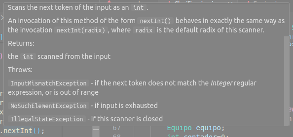

# Normas
Puedes acceder a Internet bajo tu responsabilidad.

El código debe estar comentado decentemente como mínimo.

No se aceptan bucles infinitos.

Los flujos asociables a ficheros abiertos deben manejarse correctamente. Tu IDE no debe indicar ningún riesgo de "leak" o equivalente.

Si usas códigos de terceros debes declarar al autor original en un comentario sino se considerara plagio. Importante: cosas muy concretas no todo el programa/función.

Debes controlar todas las posibles excepciones esperables (ver imagen). Te puedes ayudar de la IA para que te genere el try-catch, pero las decisiones del catch son tomadas por ti.

Si surge algún error se le debe informar al usuario, acaben derivando en un catch o no.

# Ejercicio 1

Tienes que realizar un programa que permita manejar una clasificación de fútbol de La Liga Española con 20 equipos. 
Se nos pide una clase `Clasificación` para ello.

Para los equipos, se nos pide una clase `Equipo` que tendrá los siguientes atributos:
- Nombre del equipo (único).
- Estadio que deriva de 4 campos:
    - Ciudad.
    - Calle.
    - Código postal.
    - Número.
- Victorias.
- Derrotas.
- Empates.
- Goles a favor.
- Goles en contra.
- Partidos totales.
- Puntos.
- Diferencia de goles.

Cada clase debe tener un constructor que inicialice todos los atributos.

Se hará una clase independiente donde definiremos la interfaz de usuario, que tendrá un menú con las siguientes opciones:

1. Añadir equipo.
2. Eliminar equipo.
3. Modificar equipo.
4. Mostrar la clasificación.
5. Guardar la clasificación.
6. Cargar la clasificación.
7. Guardar ubicación del estadio de cada equipo.
8. Salir.

El jefe de proyecto toma las siguientes decisiones ya que nos ve con deficiencias en Gson y La Liga quiere manejar su información con este formato de fichero.

Para la opción 1:

Se aceptarán 3 opciones de entrada (solo puede haber 1 equipo con el mismo nombre):
- Añadir el equipo preguntando campo por campo.

- Añadir el equipo mediante una String JsonObject. Antes de añadirlo debemos mostrarle al usuario que contiene cada campo por si tiene alguna errata y preguntarle si está seguro. Se leerán con un key set y después se irá mostrando su clave asociada con un get.

- Añadir el equipo mediante un archivo Json.

Para la opción 2:
- Borramos el equipo por su nombre. Si no existe se le informa al usuario.

Para la opción 3:
- Preguntamos el nombre del equipo a modificar. Luego se le pregunta por el campo a modificar y por último el valor nuevo.

Para la opción 4:
- Se sobreescribirá el método toString. Se deberá controlar el hipotético caso de que alguno de esos equipos sea null. En un inicio nos dicen que ordenemos por puntos.

Para la opción 5:

Habrá 2 opciones:
- Generar el fichero feo desde una lista.
- Generar el fichero bonito desde un array.

Para la opción 6:
- Cargar el fichero.

Para la opción 7:
- Se creará un mapa con el nombre y la dirección.
- Se almacenará en un json bonito.

Opcional:

- Guardar/Cargar la clasificación en otros formatos (csv, xml, serializado...). Dentro de una sección Opciones avanzadas.

Notas:
- Los campos calculados no se indican, esos son a libre criterio del programador.

- Si se requiere alguna clase auxiliar, método... se puede crear.

# Ejercicio 2
La Liga con fines de experimentar modificaciones nos pide que le hagamos un pequeño programa que extraiga un equipo de la clasificación aleatorio. Donde puedan:
- Leer datos.
- Modificarlos.
- Borrarlos.
- Añadir nuevas columnas.

Todo ello para estudiar solicitudes de actualización del programa. Para que lo usemos como plantilla para una actualización del programa.